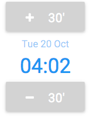

# Introduction

A UI component built primarily for input on mobile devices but usable everywhere.



# Usage

```
meteor add gevou:timeselector
```

You can easily pass a number of options as part of the component's data context. The data context is retrieved reactively i.e. if any of the options change after rendering the template the component will be updated and re-rendered accordingly.  

```html
<template name="MyTemplate">
  {{>timeSelector myOptions}}
</template>
```

```js
Template.MyTemplate.helpers({
  myOptions: function() {
    return {
      id: 'myTimeSelector', // A unique Id for this time selector  
      min: '09:00', // (optional) minimum allowed time. (Default 00:00)
      max: '17:00', // (optional) maximum allowed time. (Default 23:59)
      step: 30, // (optional) step in minutes. (Default 15 minutes)
      locale: 'en', // (optional) moment.js locale for displayed date/time (Default 'en')
      active: true // (optional) enable (true) or disable (false) input (Default 'true') 
      showDate: true // (optional) show current date (Default 'true')
    };
  }
});
```

# Retrieve the currently selected time

Rectively using the `TimeSelector.getTime(id)` method which returns a moment.js object:

```js
  var selectedTime = TimeSelector.getTime('myTimeSelector');
```

`getTime` is a reactive source so you can use it to reactively trigger helper and autorun updates, e.g.: 

```js
Template.MyTemplate.helpers({
  'timeIsLate': function() {
    var selectedTime = TimeSelector.getTime('myTimeSelector');
    var latest = moment('17:00','hh:mm');
    return selectedTime.isAfter(latest); // will update everytime time selector changes. 
  }
});
```

By reading the DOM element attribute. The value is in `hh:mm` format:
```js
  var selectedTime = $('.time-selector').attr('data-value');
```

# Capturing add/subtract events

timeSelector triggers a `timeSelectorChange` event every time the user clicks the `+` or `-` buttons. You can capture the event in your template event map as follows:

```js
Template.MyTemplate.events({
  'timeSelectorChange', function (e, tmpl, options) {
    // currently selected time is available in the options parameter

    var selectedTime = options.time; // this is a moment js object
  } 
}) 
```

# Set/Reset the currently selected time programmatically 

Through the `TimeSelector.updateTime(id, time)` method:
```js
  var newTime = '22:00'; // use moment('22:00','hh:mm') if you want to convert a moment() object
  TimeSelector.updateTime('myTimeSelector', newTime);
```

By triggering the `resetTimer` jquery event:
```js
  var newTime = '22:00'; // use moment('22:00','hh:mm') if you want to convert a moment() object
  $('.time-selector').trigger('resetTimer', newTime);
```

# Using multiple simultaneous time selectors

Wrap the selectors in separate divs to easily define individual selectors or in separate sub-templates and use `Template.instance()` for retrieving the currently selected time and setting/reseting the currently selected time programmatically.

example TBA